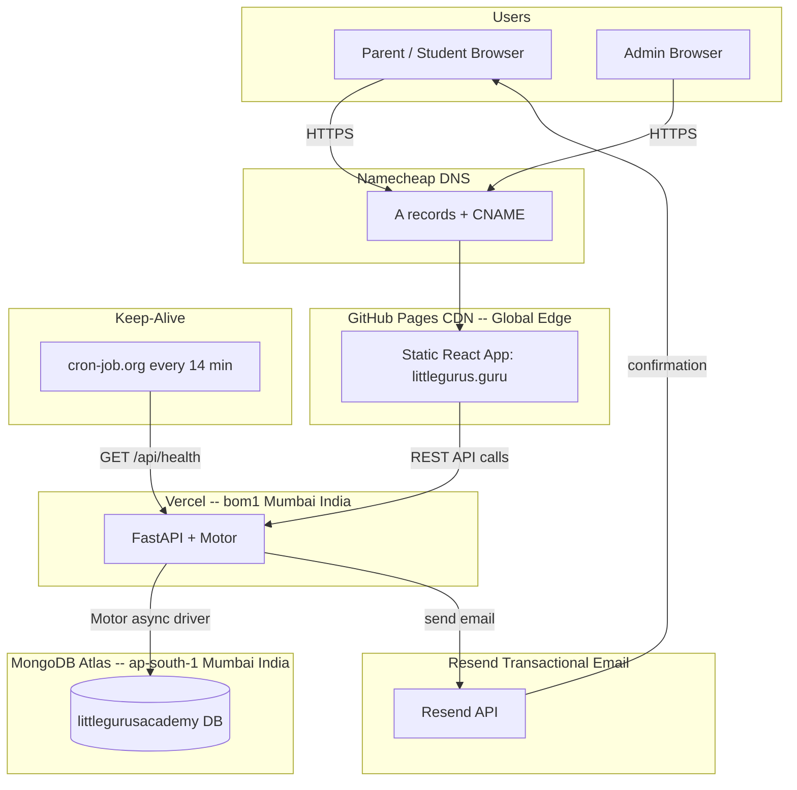
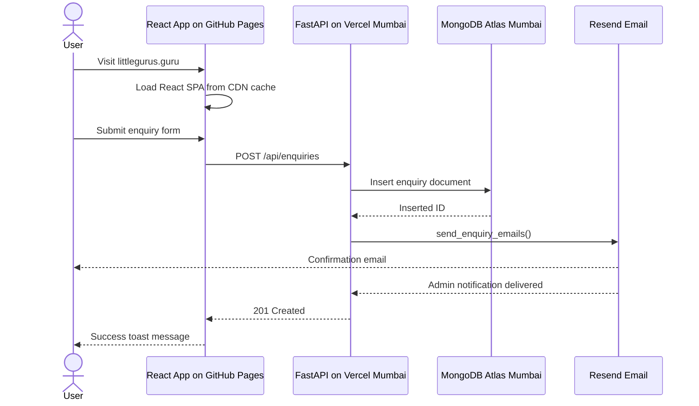
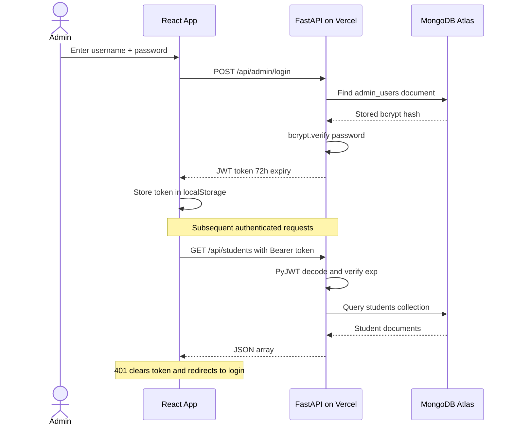
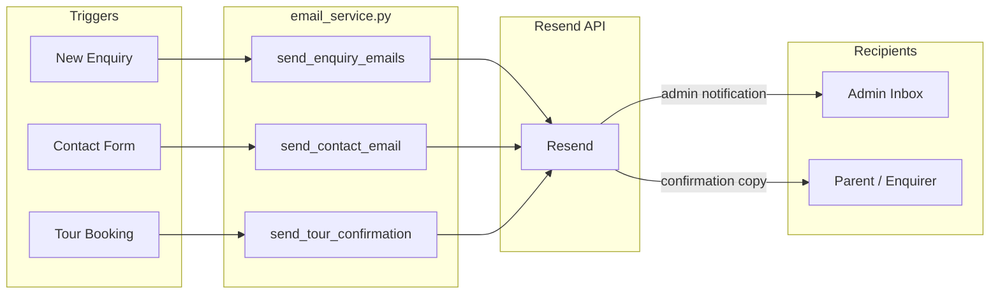
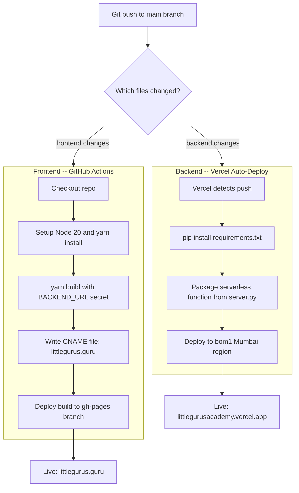
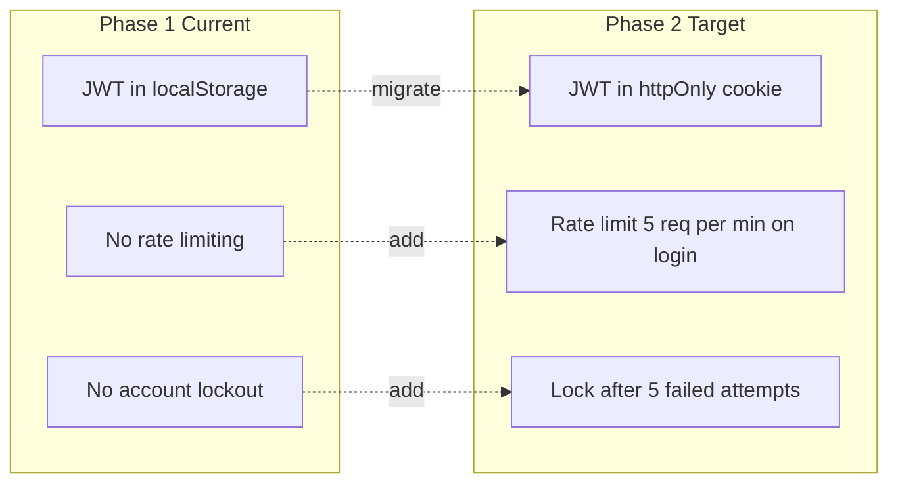
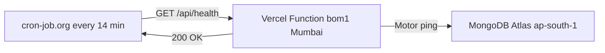

# Architecture — Little Gurus Academy

> Last updated: 2026-07-28 | Phase 1 complete · Phase 2 planned

---

## System Architecture

---

## Request Flow

---

## Authentication Flow

**Student auth** follows the same pattern using `lga_student_token` in localStorage.

---

## Email Flow

> `email_service.py` never raises — all errors are logged and the API still returns 2xx. Email failure does not break form submission.

---

## CI/CD Pipeline

---

## Database Collections

| Collection | Key Fields | Purpose |
|------------|-----------|---------|
| `admin_users` | username, password_hash | Admin authentication (seeded on startup) |
| `students` | name, email, phone, grade, password_hash | Student LMS accounts |
| `enquiries` | name, email, phone, child_age, message, created_at | Lead capture from homepage |
| `applications` | parent_name, child_name, program, status | Formal admissions flow |
| `tour_bookings` | name, email, phone, preferred_date, preferred_slot | Campus tour scheduling |
| `testimonials` | parent_name, child_info, text, rating, published | Homepage social proof |
| `videos` | title, video_url, subject, age_group, is_free | Learning library |
| `teachers` | name, role, bio, qualifications, active | About page teacher cards |
| `newsletter_subscribers` | email, subscribed_at | Marketing mailing list |
| `messages` | student_id, from_role, text, read_by_admin | LMS student-teacher chat |
| `tickets` | student_id, type, description, status, response | Student support tickets |
| `site_settings` | key, value | CMS configuration |

---

## API Endpoints Summary

### Public

| Method | Endpoint | Description |
|--------|----------|-------------|
| GET | `/api/health` | Health check |
| POST | `/api/enquiries` | Submit admission enquiry |
| POST | `/api/contact` | Contact form |
| POST | `/api/newsletter` | Subscribe to newsletter |
| POST | `/api/tour-bookings` | Book a campus tour |
| POST | `/api/applications` | Submit formal application |
| GET | `/api/testimonials` | List published testimonials |
| GET | `/api/teachers` | List active teachers |
| GET | `/api/videos` | Video library (filter: `?free=true`) |
| GET | `/api/site-settings` | CMS site configuration |

### Admin (JWT required)

| Method | Endpoint | Description |
|--------|----------|-------------|
| POST | `/api/admin/login` | Admin authentication |
| GET | `/api/admin/stats` | Dashboard counters |
| GET, PATCH | `/api/enquiries` | Manage enquiries |
| GET, PATCH | `/api/applications` | Manage applications |
| GET, POST, PATCH | `/api/students` | Manage student accounts |
| GET, POST, PATCH, DELETE | `/api/testimonials` | Manage testimonials |
| GET, POST, PATCH, DELETE | `/api/videos` | Manage video library |
| GET, POST, PATCH, DELETE | `/api/teachers` | Manage teacher profiles |
| GET, PATCH | `/api/site-settings` | Update CMS settings |
| GET | `/api/messages/admin/threads` | All student chat threads |
| POST | `/api/messages/admin` | Reply to a student |
| GET, PATCH | `/api/tickets` | Manage support tickets |

### Student (JWT required)

| Method | Endpoint | Description |
|--------|----------|-------------|
| POST | `/api/student/login` | Student authentication |
| GET | `/api/student/me` | Own profile |
| POST, GET | `/api/messages/student` | Send and read chat messages |
| POST, GET | `/api/tickets` | Create and view own tickets |

---

## Security Architecture

### Current State (Phase 1)

| Area | Status | Risk |
|------|--------|------|
| JWT storage | localStorage | XSS risk — token accessible to injected scripts |
| Rate limiting | None | Brute-force on `/api/admin/login` |
| Server-side logout | None | Token stays valid 72h after localStorage cleared |
| Brute-force lockout | None | Unlimited login attempts |
| HTTPS | Enforced via GitHub Pages + Vercel | OK |
| CORS | Restricted to `FRONTEND_URL` | OK |
| Password hashing | bcrypt | OK |

### Phase 2 Security Plan

---

## Phase 2 Roadmap

Gap analysis performed 2026-07-28 across all portals.

### Priority 1 — Fix Now (Broken UX)

| # | Gap | File to Change | Fix |
|---|-----|----------------|-----|
| 1 | No 404 page — blank white screen | `frontend/src/App.js` | Add catch-all route to `<NotFound />` component |
| 2 | DB is empty on fresh deploy | `backend/server.py` startup | Seed 2–3 testimonials, 1–2 teachers, 1–2 videos |
| 3 | "Next class" hardcoded in LMS | `frontend/src/pages/StudentLMS.jsx` | Fetch `business_hours` key from `/api/site-settings` |
| 4 | Gallery hardcoded in `data.js` | `Gallery.jsx` + `server.py` | Add `gallery` DB collection + admin CRUD + API endpoint |
| 5 | Programs page hardcoded | `Programs.jsx` + `server.py` | Add `programs` DB collection + admin CRUD + API endpoint |

### Priority 2 — Fix Soon (Missing Features)

| # | Gap | File to Change | Fix |
|---|-----|----------------|-----|
| 6 | Student can't change own password | `StudentLMS.jsx` + `server.py` | Add `PUT /api/student/password` + ProfileView form |
| 7 | No forgot-password flow | `server.py` + `email_service.py` | Add OTP endpoint + email + reset form in LMS |
| 8 | Newsletter subscribers invisible to admin | `server.py` + `Admin.jsx` | Add `GET /api/newsletter` + admin subscriber list tab |
| 9 | No video watch progress | `server.py` + `StudentLMS.jsx` | Add `video_progress` collection + progress bar |
| 10 | No unread message badge | `StudentLMS.jsx` | Track `read_by_student` flag + dot badge in sidebar |
| 11 | No welcome email on student creation | `server.py` + `email_service.py` | Call `send_welcome_email()` in `POST /api/students` |

### Priority 3 — Growth Features

| # | Gap | Fix |
|---|-----|-----|
| 12 | No delete endpoints | Add `DELETE /api/students/{id}`, `enquiries/{id}`, `applications/{id}` |
| 13 | No CSV export | Add `GET /api/admin/export/enquiries.csv` using Python `csv` module |
| 14 | No multi-admin support | Add `admin_users` CRUD + role field in JWT |
| 15 | No audit log | Add `audit_log` collection — log admin action + timestamp + user |
| 16 | Photo upload (testimonials/teachers) | Add `POST /api/upload` to Cloudflare R2 or Vercel Blob |
| 17 | No parent portal | Separate parent login, child progress view |
| 18 | No attendance tracking | Add `attendance` collection + admin mark-present UI |
| 19 | No homework/assignments | Add `assignments` collection + student submission flow |
| 20 | No class recording links | Add `recording_url` field to schedule/session model |
| 21 | Chat uses 6s polling | Migrate to WebSocket via FastAPI `websockets` |

---

## Keep-Alive Architecture

Prevents cold starts during school hours. Vercel Hobby sleeps after ~10 min idle.

---

## Cost Summary — All Free

| Service | Plan | Cost |
|---------|------|------|
| GitHub Pages | Free | Rs. 0/month |
| Vercel Hobby | Free | Rs. 0/month |
| MongoDB Atlas M0 | Free (512 MB) | Rs. 0/month |
| Resend | Free (3,000 emails/month) | Rs. 0/month |
| Namecheap DNS | Included with domain | ~Rs. 800/year |
| cron-job.org | Free | Rs. 0/month |
| **Total** | | **~Rs. 800/year** |
